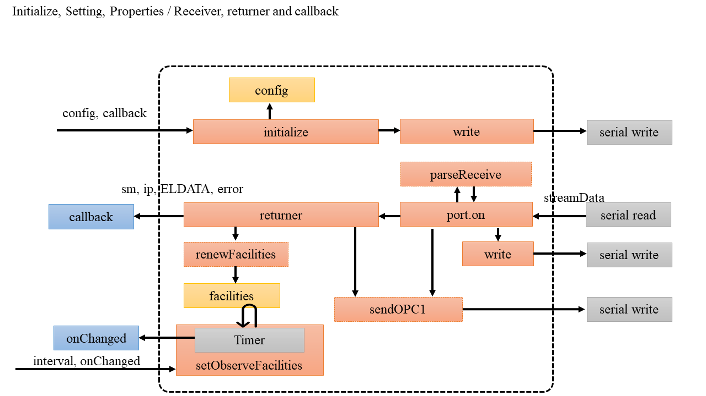
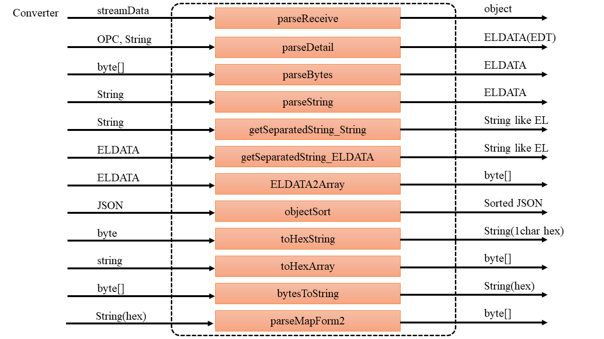
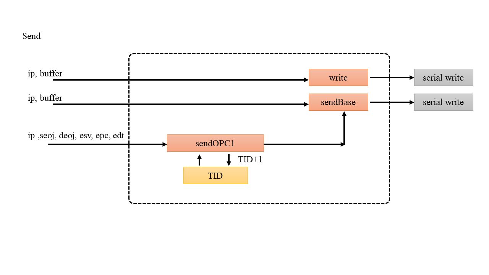
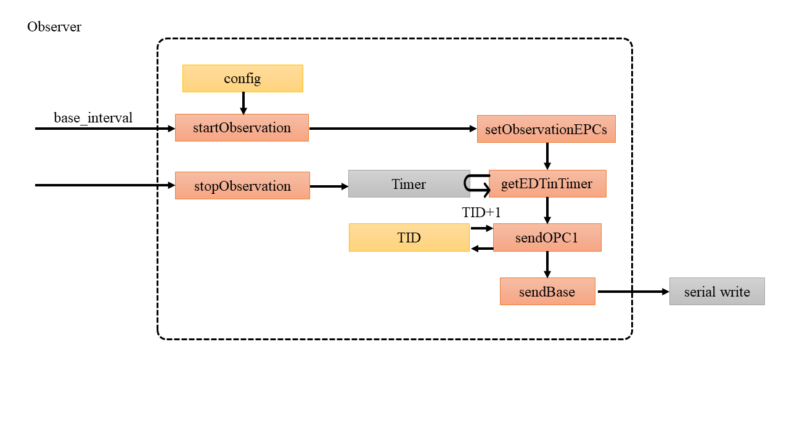

# Overview, e-smartmeter-echonet-lite

このドキュメントは日英併記です．

This document is Japanese and English written together.


このモジュールは**日本向け電力スマートメーターとのECHONET Liteプロトコル通信**をサポートします．
ECHONET Liteプロトコルはスマートハウス機器の通信プロトコルで，正確には低圧スマート電力量メーターをサポートします．
通信モジュールとしてWi-SUNモジュール（TESSERA RL7023またはROHM BP35C2）が必須です．

- TESSERA RL7023
(https://www.tessera.co.jp/rl7023stick-d_ips.html)

- ROHM BP35C2
(https://www.rohm.co.jp/products/wireless-communication/specified-low-power-radio-modules/bp35c2-product#productDetail)

This module provides **ECHONET Lite protocol for Low-voltage smart electric energy meter in Japan**.
The ECHONET Lite protocol is a communication protocol for smart home devices.
This module requires USB Wi-SUN module (TESSERA RL7023 or ROHM BP35C2) for communication.

- TESSERA RL7023
(https://www.tessera.co.jp/rl7023stick-d_ips.html)

- ROHM BP35C2
(https://www.rohm.co.jp/products/wireless-communication/specified-low-power-radio-modules/bp35c2-product#productDetail)


## Menu

[TOC]

# Install

下記コマンドでモジュールをインストールできます．

You can install the module as following command.


```bash
npm i e-smartmeter-echonet-lite
```


# Demos

デモプログラムはこんな感じです。
動作させるためには電力会社のBルートサービスの利用申し込みが必要です。
電力会社に申請をすると，**Bルート認証ID設定**と**Bルート認証パスワード設定**をもらえます．

Here is a demonstration script.
Your ID and password for B route service is required.

```JavaScript:Demo
//////////////////////////////////////////////////////////////////////
let eSM = require('e-smartmeter-echonet-lite');


////////////////////////////////////////////////////////////////////////////
// config
let config = {
  dongleType: 'ROHM',  // 'ROHM' or 'TESSERA', default:TESSERA
  id:'01234567890QWERTYUIOPASDFGHJKLZX',   // Bルート認証ID設定, Your B route ID.
  password:'123456789ABC',   // Bルート認証パスワード設定, Your B route password.
  observationEPCs: ['80','81','82','88','8A','8D','97','98','9D','9E','9F',
                    'D3','D7','E0','E1','E2','E3','E4','E5','E7','E8','EA','EB','EC','ED']
}

// 初回起動のみ実施するためのフラグ, flag for first connection
let connected = false;


// 初期化, initializing
eSM.initialize( config, ( sm, rinfo, els, err) => {
	console.log( '## user function', (new Date()).toLocaleString(), '##' );
	if( err ) {
		console.log( 'eSM Error' );
		console.dir( err );
		return;
	}
	console.log( JSON.stringify(sm) );
	rinfo ? console.dir( rinfo ):0;
	els ? console.dir( els ):0;

	try{
		// 初回接続時, first connection
		if( !connected && sm.state == 'available' ) {
			connected = true;

			// config.observationEPCsのEPCを定期的にGetする
			eSM.startObservation( 60 * 1000 );
		}
	}catch(e){
		console.error(e);
	}
	console.log( '## ============= ##' );

});


// 機器情報の変化の監視, observation for changing facilities
eSM.setObserveFacilities( 10 * 1000, () => {
	console.log( '## == onChanged', (new Date()).toLocaleString(), '== ##' );
	console.dir( eSM.facilities );
	console.log( '## ============= ##' );
});
```


# Data stracture

### コンフィグ (config)

```JavaScript
{
  dongleType: String,  // 'ROHM' or 'TESSERA', default:TESSERA
  id: String,   // Bルート認証ID設定, Your B route ID. **Required**.
  password:String,   // Bルート認証パスワード設定, Your B route password. **Required**.
  observationEPCs: array, element is string,  // Optional.
  debug: Boolean,  // debug mode , Optional. default false.
  EPANDESC: Strunct {  // Connection info for smart meter, Optional. (for resume connection)
  	path: String,
	channel: String,
	channelPage: String,
	panID: String,
	address: String,
	lqi: String,
	pairID: String'
  }
}
```


### スマートメーターとの通信状態 (sm)

sm (smart meter)はスマートメーターとの通信シーケンスの状態や受信データそのものを格納します．

sm (smart meter object) stores state of the connection sequence and received messages.

```JavaScript
{
	"state":"available",
	"data":{
		"count":1,
		"msgs": [
			[
				"ERXUDP",
				"FE80:0000:0000:0000:021C:6400:03EF:EDFD",
				"FE80:0000:0000:0000:1207:23FF:FEA0:7831",
				"0E1A",
				"0E1A",
				"001C640003EFEDFD",
				"1",
				"001A",
				"1081000202880105FF0172018D0C413137583037343137350000"
			]
		]
	}
}
```


### 受信データ (rinfo)

rinfoはスマートメーターのIP(IPv６)とポートです．

rinfo is the IPv6 and port of smart meter.

```JavaScript
{
  address: 'FE80:0000:0000:0000:021C:6400:03EF:EDFD',
  port: '0E1A'
}
```


### 受信データ （els）

elsはスマートメーターとのECHONET Lite通信が行われたときに，下記の構造体の形式で解析したオブジェクトが格納されています．

els stores ECHONET Lite data as following when received ECHONET Lite packet from smart meter.


```JavaScript
{
  EHD : str,
  TID : str,
  SEOJ : str,
  DEOJ : str,
  EDATA: str,    // EDATA is followings
  ESV : str,
  OPC : str,
  DETAIL: str,
  DETAILs: { epc: edt }
}
```

### オブジェクト内の機器情報リスト (facilities)

受信データの最新値をfacilitiesに記録しています．

The property named facilities stores last receive data.

```JavaScript
EL.facilities =
{
  'FE80:0000:0000:0000:0000:0000:XXXX:XXXX': {
    '028801': {
      '80': '30',
      '81': '61',
      '82': '00004600',
      '88': '42',
      '97': '0929',
      '98': '07e50917',
      '8d': '413137583037343137350000',
      '9f': '19808182888a8d97989d9e9fd3d7e0e1e2e3e4e5e7e8eaebeced',
      eb: '07e50917091e000000003e',
      e0: '0007a78d',
      '9e': '0381e5ed',
      e7: '0000009e',
      d7: '06',
      d3: '00000001',
      '8a': '000016',
      ea: '07e50917091e000007a787',
      ed: 'ffffffffffff01',
      e1: '02',
      ec: 'ffffffffffff01fffffffefffffffe',
      e2: '00fffffffffefffffffefffffffefffffffefffffffefffffffefffffffefffffffefffffffefffffffefffffffefffffffefffffffefffffffefffffffefffffffefffffffefffffffefffffffefffffffefffffffefffffffefffffffefffffffefffffffefffffffefffffffefffffffefffffffefffffffefffffffefffffffefffffffefffffffefffffffefffffffefffffffefffffffefffffffefffffffefffffffefffffffefffffffefffffffefffffffefffffffefffffffefffffffe',
      e5: 'ff',
      e3: '0000003e',
      '9d': '03808188',
      e4: '00fffffffffefffffffefffffffefffffffefffffffefffffffefffffffefffffffefffffffefffffffefffffffefffffffefffffffefffffffefffffffefffffffefffffffefffffffefffffffefffffffefffffffefffffffefffffffefffffffefffffffefffffffefffffffefffffffefffffffefffffffefffffffefffffffefffffffefffffffefffffffefffffffefffffffefffffffefffffffefffffffefffffffefffffffefffffffefffffffefffffffefffffffefffffffefffffffe',
      e8: '00147ffe'
    }
  }
}
```


# API

## 初期化, 受信, 監視, initialize, receriver callback and observation



### 初期化, initialize

通信を開始します．

start connection.

```JavaScript
ESmartMeter.initialize = function( config, callback )
```

- config is description of your environment to connect smart meter.
- callback is the your function. callback is described as following.

```JavaScript
function( sm, rinfo, els, err ) {
	console.log('==============================');
	if( err ) {
		console.dir(err);
	}else{
		// ToDo
	}
}
```


### ポートリスト取得, renewPortList

利用可能なポートリストを更新する

renew serial port list

```JavaScript
ESmartMeter.renewPortList = function()
```

```JavaScript
ESmartMeter.portList: Array(port)
```


### 解放, release

通信を終了します．

release connection.

```JavaScript
ESmartMeter.release = function()
```


## 変換系, converters



| from              |    to             |   function                         |
|:-----------------:|:-----------------:|:----------------------------------:|
| serial,Byte[]     | EPANDESC          | getEPANDESC(str)                   |
| serial,Byte[]     | String            | getIPv6(str)                   |
| String            | ELDATA(EDT)       | parseDetail(opc,str)               |
| Byte[]            | ELDATA            | parseBytes(Byte[])                 |
| String            | ELDATA            | parseString(str)                   |
| String            | String (like EL)  | getSeparatedString_String(str)     |
| ELDATA            | String (like EL)  | getSeparatedString_ELDATA(eldata)  |
| ELDATA            | Bytes(=Integer[]) | ELDATA2Array(eldata)               |
| Byte              | 16進表現String    | toHexString(byte)                  |
| 16進表現String    | Integer[]         | toHexArray(str)                    |
| Byte[]            | String            | bytesToString(byte[])              |
| serial, Byte[]    | Object            | parseReceive(streamData)           |
| String(EDT)       | String            | parseMapForm2(bitstr)              |


### スマートメータのチャンネルスキャンの情報を解析する

```JavaScript
ESmartMeter.getEPANDESC = function ( str )
```

### スマートメータのIPv6アドレス取得データを解析する

```JavaScript
ESmartMeter.getIPv6 = function ( str )
```


### ECHONET LiteパケットのDetailだけをParse

* DetailだけをParseする，内部でよく使うけど外部で使うかわかりません．
* inner function. Parses only detail (for echonet lite data frame).

```JavaScript
ESmartMeter.parseDetail = function( opc, str )
```

### byte dataを入力するとELDATA形式にする

* bytes -> ELDATA type

```JavaScript
ESmartMeter.parseBytes = function( bytes )
```

### HEXで表現されたStringをいれるとELDATA形式にする

* HEX string -> ELDATA

```JavaScript
ESmartMeter.parseString = function( str )
```


### 文字列をいれるとELらしい切り方のStringを得る

* String -> EL-like String

```JavaScript
ESmartMeter.getSeparatedString_String = function( str )
```


### ELDATAをいれるとELらしい切り方のStringを得る

* * ELDATA -> EL-like String

```JavaScript
ESmartMeter.getSeparatedString_ELDATA = function( eldata )
```

###  1バイトを文字列の16進表現へ（1Byteは必ず2文字にする）

* a byte -> HEX string

```JavaScript
ESmartMeter.toHexString = function( byte )
```


### バイト配列を文字列にかえる

```JavaScript
ESmartMeter.bytesToString = function (bytes)
```


### ELDATA形式から配列へ

```JavaScript
ESmartMeter.ELDATA2Array = function (eldata)
```


### プロパティマップの形式2を形式1のようにわかりやすく

* 16以上のプロパティ数の時，記述形式2
* 出力はForm1のようにEPCの列挙う, bitstr = EDT

```JavaScript
ESmartMeter.parseMapForm2 = function (bitstr)
```


### Serial portからの受信ストリームデータを解析して構造化

```JavaScript
ESmartMeter.parseReceive = function(streamData)
```


### ネットワーク内のEL機器全体情報を検索する

現在モジュールが保持している最新情報を取得する

- ip: Required.
- obj: Optional.
- epc: Optional.

```JavaScript
ESmartMeter.searchFacilities( ip, obj, epc )
```


## 送信, send

ELの通信は送信の成功失敗に関わらず，TIDをreturnすることにしました。
送信TIDはEL.tid[]で管理しています。
sendOPC1はEL.tidを自動的に+1します。




### シリアル通知，送信のベース

```JavaScript
ESmartMeter.write = function ( str )
```

### EL送信のベース

```JavaScript
ESmartMeter.sendBaseR = function (ip, buffer)  // for ROHM
ESmartMeter.sendBaseT = function (ip, buffer)  // for TESSERA
```

### EL送信の基本的なAPI，大体これを使ったらよい

```JavaScript
ESmartMeter.sendOPC1 = function (ipv6, seoj, deoj, esv, epc, edt)
```


## 監視系



### EPCの監視開始

まずobservationEPCsに監視対象のEPCを文字列表現の16進数で列挙します．

first, set observed EPCs into config.observationEPCs;

```JavaScript
config.observationEPCs = ['E1','E2']; // e.g.
```

startObservationをインターバル指定して実行します．

call the startObservation with an argument as interval time.

```JavaScript
ESmartMeter.startObservation( 60 * 1000 );  // interval, millisecond
```

### EPCの監視終了

```JavaScript
ESmartMeter.stopObservation = function()
```

### 通信データの更新の監視

最新データを監視し，更新されていた場合にonChangeとして登録したコールバック関数を呼び出します．

observe the properties of facilities, if properties are updated, call your function as onChanged.

```JavaScript
ESmartMeter.setObserveFacilities = function ( interval, onChanged ) // interval, millisecond
```


### ネットワーク内のEL機器全体情報を更新（内部処理）

受信したら勝手に実行される．

```JavaScript
ESmartMeter.renewFacilities = function (ip, els)
```


# 受信データの解析

echonet-lite-conv を使うと簡単に解析できます．

- echonet-lite-conv
(https://www.npmjs.com/package/echonet-lite-conv)

```bash
npm i echonet-lite-conv
```

使い方は下記の様にすれば良いです．
この例はデモスクリプトの拡張なので，比較してみてください．

```JavaScript:Demo extended echonet-lite-conf
//////////////////////////////////////////////////////////////////////
const cron = require('node-cron');
let eSM = require('e-smartmeter-echonet-lite');
let ELconv = require('echonet-lite-conv');
let util = require('util');

ELconv.initialize();  // コンバータを初期化しておく（JSON形式の定義データを読む）

////////////////////////////////////////////////////////////////////////////
// config
let config = {
  id:'01234567890QWERTYUIOPASDFGHJKLZX',   // Bルート認証ID設定, Your B route ID.
  password:'123456789ABC',   // Bルート認証パスワード設定, Your B route password.
  observationEPCs: ['80','81','82','88','8A','8D','97','98','9D','9E','9F',
                    'D3','D7','E0','E1','E2','E3','E4','E5','E7','E8','EA','EB','EC','ED']
}

// 初回起動のみ実施するためのフラグ, flag for first connection
let connected = false;


// 初期化, initializing
cron.schedule('*/5 * * * * *', () => {
	// 既に接続していたら機器情報の変化をみる。接続していなかったら接続する
	// 5秒に1回、ポートの状況を監視している
	if( connected ) {
		// 機器情報の変化の監視
		console.log( '## == facilities', (new Date()).toLocaleString(), '== ##' );
		console.dir( eSM.facilities );

	}else{
		// 初期化
		eSM.initialize( config, ( sm, rinfo, els, err) => {
			console.log( '## user function', (new Date()).toLocaleString(), '##' );

			if( err ) {
				console.log( 'eSM Error:', err );
				return;
			}

			console.dir( 'eSM:', sm);

			// 切断された
			if( sm.state == 'close' ) {
				connected = false;
				return;
			}

			// console.log( JSON.stringify(sm) );
			// rinfo ? console.dir( rinfo ):0;
			els ? console.dir( els ):0;

			try{
				// 初回接続時
				if( !connected && sm.state == 'available' ) {
					connected = true;

					// config.observationEPCsのEPCを定期的にGetする
					console.log('## start observation.');
					eSM.startObservation( 30 * 1000 );

					eSM.getStatic();
				}
			}catch(e){
				console.error(e);
			}
			console.log( '## ============= ##' );
		});
	}

});
```


# meta data

## Authors

神奈川工科大学  創造工学部  ホームエレクトロニクス開発学科; Dept. of Home Electronics, Faculty of Creative Engineering, Kanagawa Institute of Technology

杉村　博; SUGIMURA, Hiroshi

## thanks

- Thanks to Github users!
- Thanks to Qiita users!

## License

MIT License

```
-- License summary --
o Commercial use
o Modification
o Distribution
o Private use
x Liability
x Warranty
```


## Log

- 2.6.6 なおした
- 2.6.5 もう少し丁寧に
- 2.6.4 EPANDESCがとれてLQIが取れないときのバグとり
- 2.6.3 無駄なログが残っていたので削除
- 2.6.2 いらないAPIの削除、リトライで戻ってこないときがあるのを修正、リトライ最大回数が達した場合のエラーでエラー扱いされない場合を修正、リトライエラー終了でリソースが解放されていなかったのを修正、getMeasuredValues追加、debug時にscan後でLQIの評価を出してみる。
- 2.6.1 getStaticのプロパティが多すぎたので減らした
- 2.6.0 ドングル挿抜対応、connectingのログを軽く、portのpath自動化、node-serialport ver10以上対応、ドングルぬいた時のコネクションcloseがユーザのコールバックからわかるように、channel scanがたまに失敗するのでリトライ追加、getStatic関数バグ修正、getStaticでプロファイルオブジェクトとメータオブジェクトの両方をとるように
- 2.5.0 チャンネルスキャン中に邪魔しないように
- 2.1.4 まだログ残ってた
- 2.1.3 リトライ調整
- 2.1.2 ログ消すの忘れた
- 2.1.1 初期化のバグを修正
- 2.1.0 method( renewPortList, release )を追加
- 2.0.0 ROHM BP35C2に対応
- 1.0.1 READMEだけ修正
- 1.0.0 とりあえず開発してpublish、TESSERA RL7023のみ対応
